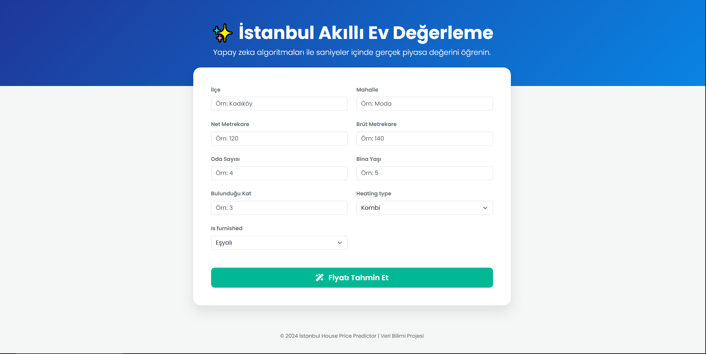
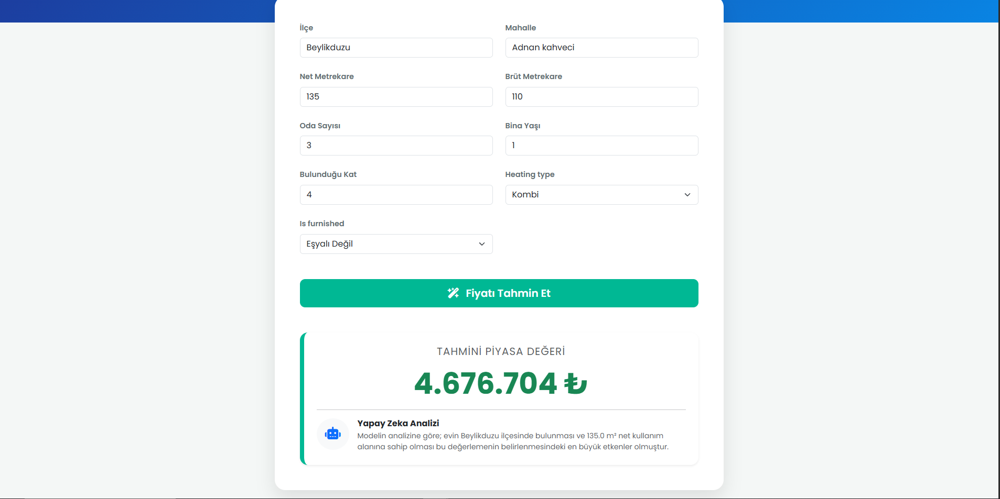

# 🏙️ Istanbul Real Estate AI Valuation System
> **End-to-End Data Science & Machine Learning Pipeline**


An end-to-end Machine Learning project that predicts real estate prices in Istanbul using actual market data. This project covers the entire data science lifecycle: from web scraping and data engineering to model training (LightGBM) and full-stack web deployment via Django.

---

## 📸 Screenshots

<p align="center">
  
</p>

<p align="center">
  
</p>

---

## 🚀 Project Journey & Development Process

This project is not simply about training a model; it is a fully-fledged system built by overcoming the challenges of working with real-world data.

### 🗓️ Phase 1: Data Gathering (2 Days)
- **Web Scraping:** Developed a custom Python web scraper using `BeautifulSoup` and `Requests`.
- **Target:** Extracted over 2,100 unique real estate listings across various districts of Istanbul.
- **Challenges Overcome:** Handled pagination, dynamic content loading, and avoided bot-detection mechanisms.
- **Storage:** Designed a relational database schema and stored the raw data in a local **MySQL** database ensuring no duplicate entries (`INSERT IGNORE`).

### 🗓️ Phase 2: Data Engineering & EDA (2 Day)
- **Data Cleaning:** Handled missing values (NaN), converted text-based features (e.g., heating types, furnished status) into categorical variables.
- **Feature Engineering:** Converted complex floor levels (e.g., "Giriş", "Bodrum") into numeric values, parsed room counts (e.g., "3+1" -> 4).
- **Outlier Removal:** Filtered out extreme luxury mansions (>50M TL) and micro-apartments to prevent model bias.

### 🗓️ Phase 3: Machine Learning & Modeling (2 Days)
- **Algorithm:** Tested various models (Random Forest, XGBoost) and settled on **LightGBM** due to its superior performance on tabular data and high cardinality categorical features (districts/neighborhoods).
- **Transformation:** Applied **Logarithmic Transformation** (`np.log1p`) to the highly right-skewed target variable (Price) to minimize prediction errors on luxury segments.
- **Pipeline:** Built a robust `scikit-learn` Pipeline utilizing `TargetEncoder` for high-cardinality location data.
- **Results:** Achieved an **R² Score of ~0.78**, successfully explaining 78% of the variance in Istanbul's complex housing market.

### 🗓️ Phase 4: Full-Stack Deployment (2 Days)
- **Backend:** Integrated the serialized `pickle` model into a **Django** web application.
- **Inference Pipeline:** Handled real-time user inputs, ensuring data types matched the training format (preventing `NaN` errors during inference).
- **Frontend:** Designed a modern, responsive UI using **Bootstrap 5**, providing users with instant valuations and AI-generated dynamic analysis comments.

---

## 🛠️ Tech Stack

**Data Scraping & Storage:**
- Python, BeautifulSoup4, Requests
- MySQL (DataGrip)

**Machine Learning (AI):**
- Pandas, NumPy
- Scikit-Learn (Pipelines, Target Encoding)
- LightGBM (`LGBMRegressor`)
- Matplotlib, Seaborn (EDA & Visualization)

**Web Development:**
- Django
- HTML5, CSS3, Bootstrap 5

---

## 🧠 Model Architecture & Technical Highlights

1. **Target Encoding:** Instead of creating hundreds of sparse columns with One-Hot Encoding for Istanbul's districts and neighborhoods, `TargetEncoder` was used to mathematically map locations to their expected average prices.
2. **Log-Level Prediction:** The model predicts the natural logarithm of the price, which prevents it from being overly sensitive to extreme values. The Django view handles the `np.expm1()` reverse transformation before showing the result to the user.
3. **Robust Inference:** The web app strictly enforces data casting (`astype(float) / astype(str)`) before sending web form data to the LightGBM model, preventing `ufunc 'isnan'` errors.

---

## ⚙️ How to Run Locally

If you want to test this project on your local machine:

1. **Clone the repository:**
   ```bash
   git clone https://github.com/akfoz45/Real-Estate-Scraper.git
   cd real-estate-scraper
   ```

2. **Install dependencies:**
   ```bash
   pip install -r requirements.txt
   ```

3. **Run the Django Development Server:**
   ```bash
   cd config
   python manage.py runserver
   ```

4. **Access the Web App:**
   Open your browser and navigate to http://127.0.0.1:8000/

